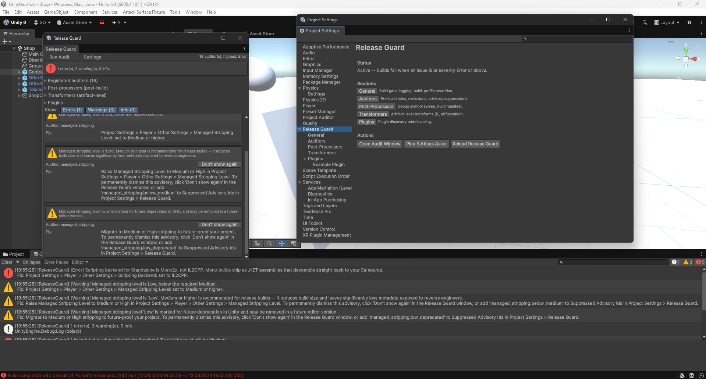

# Release Guard

[](https://github.com/SteveOberst/release-guard/releases/latest)
[](https://unity.com/releases/editor/archive)
[](LICENSE.md)
[](https://github.com/SteveOberst/release-guard/actions/workflows/validate.yml)

Release Guard is a Unity editor package that blocks bad release builds before the player is written to disk.

It ships with built-in hardening checks for the failures teams actually leave behind:

- Mono instead of IL2CPP
- Development Build still enabled
- script debugging or profiler connection left on
- weak stripping settings
- broad preserve rules that defeat stripping
- release-only code marked with `[ReleaseForbidden]`
- Android templates that explicitly set `debuggable=true`
- output-folder cleanup and manifest generation after successful builds
- and much more



## Install

Git URL:

```text
https://github.com/SteveOberst/release-guard.git?path=/release-guard
```

Open `Window > Package Manager`, choose `+ > Add package from git URL`, and paste the URL.

OpenUPM:

```bash
openupm add io.researchy.release-guard
```

## First-use behavior

Release Guard creates its registry and default profile assets during editor startup after import.

Expect these files to appear in your project:

- `Assets/ReleaseGuard/registry.asset`
- `Assets/ReleaseGuard/Profiles/release.asset`
- `Assets/ReleaseGuard/Profiles/development.asset`

Open `Edit > Project Settings > Release Guard` to inspect and edit them.

The package is profile-based. Real builds use the first matching Release Guard profile, not simply "whatever you were editing last in Project Settings".

If those assets do not appear:

- fix any compile errors first
- wait for Unity to finish the domain reload
- reopen the Project Settings page after the reload
- check the Console for initialization errors from Release Guard

The package cannot seed its assets while the editor is in a broken compile state.

## Quick start

1. Open `Edit > Project Settings > Release Guard`.
2. Review the default `Release` and `Development` profiles.
3. Open `Tools > Release Guard > Pre-Build Checks` and click `Run Checks`.
4. Make a real build.
5. Commit the registry and profile assets under `Assets/ReleaseGuard/`.

The checks window only dispatches the `pre-build` event. Output-folder components such as `debug_symbol_sweep` and `build_manifest` run only on real builds.


## How settings are chosen

| Situation | How Release Guard resolves settings |
|---|---|
| Checks window | Uses the currently edited profile |
| Local editor build | Uses the first profile whose activation matches the build |
| Local batchmode build | Uses the first matching profile and treats the run as CI |
| CI build | Uses the first matching profile and treats the run as CI |

The seeded `Development` profile is intentionally looser than `Release`, but it does not just disable three checks. It leaves some guardrails enabled and disables a broader set of release-only checks. See [Quickstart](release-guard/Documentation~/quickstart.md) and [Build profiles](release-guard/Documentation~/build-profiles.md) for the actual seeded defaults.

## `[ReleaseForbidden]`

Mark code that must never ship:

```csharp
using ReleaseGuard;

#if UNITY_EDITOR || DEVELOPMENT_BUILD
[ReleaseForbidden(ReleaseIssueSeverity.Error, "Debug-only admin command")]
public static void GrantAllCurrency() { }
#endif
```

The built-in `release_forbidden` component scans player-shipping assemblies during the `pre-build` event. The attribute does not remove code from the build on its own; it makes the build fail if the marked symbol would ship.

## Custom components

The extension point is `ReleaseGuardComponent`.

Example:

```csharp
using ReleaseGuard.Editor.Core.Components;
using ReleaseGuard.Editor.Core.PreBuild;
using UnityEditor;

public sealed class CompanyNameComponent : ReleaseGuardComponent
{
    public override string Id => "com.example.company_name";
    public override string DisplayName => "Company name configured";

    public override void Register(ReleaseGuardComponentBinder binder)
    {
        binder.OnPreBuild(OnPreBuild);
    }

    private static void OnPreBuild(ReleaseGuardPreBuildEvent releaseEvent)
    {
        var context = releaseEvent.Context;

        if (string.IsNullOrWhiteSpace(PlayerSettings.companyName) ||
            PlayerSettings.companyName == "DefaultCompany")
        {
            context.Error(
                "Company name is unset or still 'DefaultCompany'.",
                fixHint: "Set Project Settings > Player > Company Name.");
        }
    }
}
```

Register components explicitly through a plugin when you want predictable startup, plugin identity, or plugin settings.

Canonical handler shape:

- `OnPreBuild(ReleaseGuardPreBuildEvent releaseEvent)`
- `OnBuild(ReleaseGuardBuildEvent releaseEvent)`
- `OnPostBuild(ReleaseGuardPostBuildEvent releaseEvent)`

Then use `releaseEvent.Context` for the phase-specific API.

Assembly split:

- `[ReleaseForbidden]` is runtime-safe and comes from `ReleaseGuard.Runtime`
- custom components, plugins, and plugin settings belong in an Editor assembly and usually reference `ReleaseGuard.Editor` plus `ReleaseGuard.Runtime`

## CI

Release Guard works through Unity's normal build hooks:

- `IPreprocessBuildWithReport`
- `IPostprocessBuildWithReport`

If a CI job already builds through Unity normally, Release Guard is already in that path.

Important: Release Guard treats any batchmode run as CI. That includes local command-line batchmode builds, which will be labeled `CI_Unknown` when no known CI vendor variable is present.

The optional `build_manifest` component writes `release-guard-manifest.json` after a successful build. Treat it as a CI artifact, not a player-facing file. The `outputPath` setting lets you redirect the file to a dedicated artifacts folder so it never lands next to shippable binaries. Useful downstream uses include artifact validation, provenance, packaging assertions, and release-pipeline conformance checks.

## Roadmap

The current built-ins cover build hygiene - settings that are wrong, code that should not ship, artifacts left in the output folder. That is a useful floor but not a full hardening story.

The longer-term goal is to add meaningful code and asset protection so that smaller studios have a free, low-complexity option rather than paying for a commercial solution. Planned areas include code obfuscation, asset protection, build integrity verification, and basic runtime hardening hooks.

This project is intentionally not trying to become an aggressive protection layer in the vein of tools like Themida or VMProtect. That level of complexity introduces its own stability and maintenance cost that is not a good fit for most Unity studios. The aim is practical, composable protection that a small team can adopt, understand, and trust.

Contributions are welcome. If you are working in one of these areas or have a use case not yet covered, open an issue.

## Documentation

| Document | Purpose |
|---|---|
| [Documentation index](release-guard/Documentation~/index.md) | Start here |
| [Quickstart](release-guard/Documentation~/quickstart.md) | Install to first blocked build |
| [Configuring](release-guard/Documentation~/configuring.md) | Minimal settings map |
| [Build profiles](release-guard/Documentation~/build-profiles.md) | How build-time profile selection actually works |
| [CI integration](release-guard/Documentation~/guides/ci-integration.md) | Batchmode behavior, manifest, and pipeline implications |
| [Custom components](release-guard/Documentation~/guides/custom-components.md) | Write your own `ReleaseGuardComponent` |
| [Plugins](release-guard/Documentation~/api/plugins.md) | Explicit registration and plugin settings |
| [Built-in components overview](release-guard/Documentation~/reference/components.md) | Every shipped built-in and its role |

