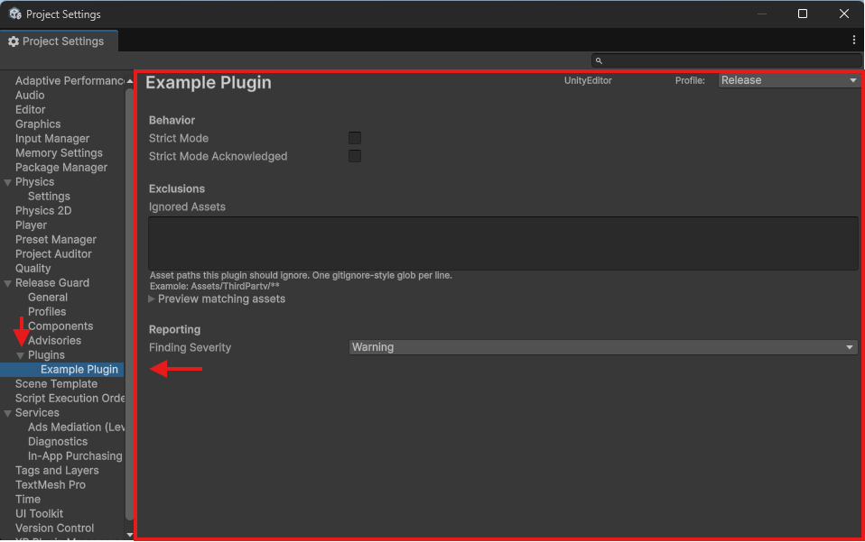

# Plugin Settings and Settings UI

Plugin settings are declared by subclassing `ReleaseGuardPluginSettings`.

## Minimal example

```csharp
using ReleaseGuard;
using ReleaseGuard.Editor.Core.Config.Attributes;
using ReleaseGuard.Editor.Core.Plugins;

[SettingsPage("Example Plugin", intro: "Controls for the example component.")]
public sealed class ExamplePluginSettings : ReleaseGuardPluginSettings
{
    [SettingsHeader("Behavior")]
    public bool strictMode = false;

    [SettingsHeader("Reporting")]
    public ReleaseIssueSeverity findingSeverity = ReleaseIssueSeverity.Warning;
}
```

Then expose it from your plugin:

```csharp
public override System.Type SettingsType => typeof(ExamplePluginSettings);
```

## Storage location

The asset is created under:

`Assets/ReleaseGuard/Plugins/{pluginId}.asset`

That file appears only for plugins that declare `SettingsType`.

In practice, it appears when that plugin initializes successfully and Release Guard wires the settings asset for it.

## What the framework renders automatically

By default, the generated settings page uses the same settings UI system as the built-in pages.

Common behavior:

- primitive serialized fields render as standard controls
- `List<string>` renders as a multiline list editor
- `ExclusionList` gets a specialized UI with preview support
- `SettingsHeader` creates section headings
- `SettingsLabel` overrides the displayed label
- `Tooltip` shows standard Unity tooltips

## Advanced UI

Override `ConfigureReader(SettingsComponentReader reader)` when you need to register custom settings-page readers.

That is an advanced path. Most plugins should stay with the stock serialized-field rendering unless a custom control is genuinely necessary.

## Important distinction

This page is about plugin settings pages.

It is not the same as the package's built-in profile settings model, which lives in `ReleaseGuardSettings` assets under `Assets/ReleaseGuard/Profiles/`.

For the deeper settings discussion, including plugin settings versus per-profile component settings and more complex extension patterns, continue with [Advanced plugin settings](../guides/advanced-plugin-settings.md).

## Where the UI shows up

When a plugin declares `SettingsType`, Release Guard creates a Project Settings sub-page for that plugin under `Edit > Project Settings > Release Guard > Plugins`.


