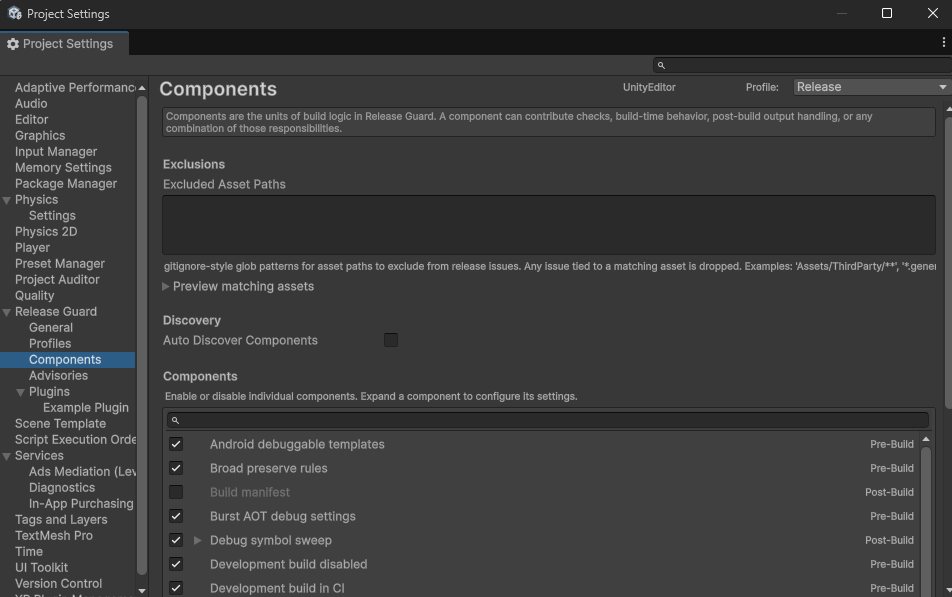
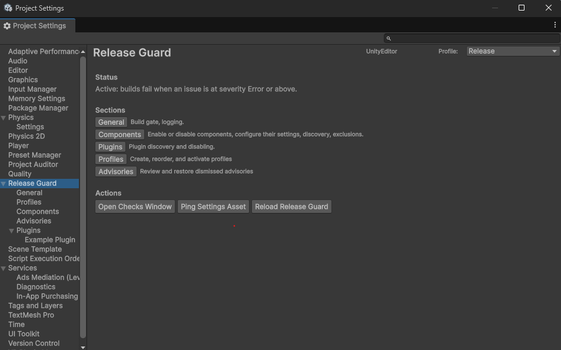
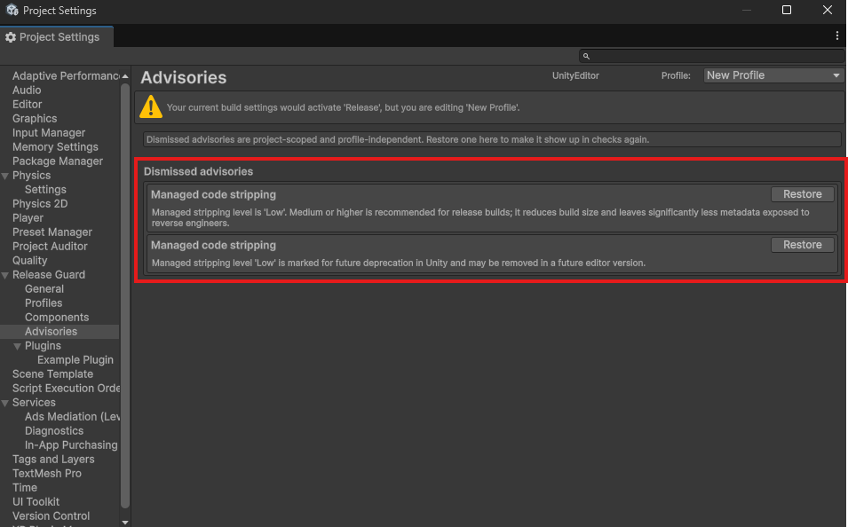

# Configuring Release Guard

This page is intentionally short. The detailed behavior lives in the individual component pages, because the important question is not just "what does this checkbox toggle?" but "what exact problem does this component exist to prevent?"

## Settings model

Release Guard settings are profile-based.

- `registry.asset` stores the profile list and activation conditions
- each profile has its own `ReleaseGuardSettings` asset under `Assets/ReleaseGuard/Profiles/`

The profile selected in the Project Settings header controls what you are editing.

Real builds do not use the currently edited profile. They use the first profile whose activation condition matches the build. See [Build profiles](build-profiles.md).

One important implementation detail from the live codebase:

- per-component enablement and component-specific settings live inside `components.componentToggles`
- advisory suppression is not stored in the profile asset; it is project-scoped state in `AdvisorySuppressionStore`

## Project Settings pages

Release Guard currently exposes five first-class Project Settings pages:

- `Profiles`
- `General`
- `Components`
- `Advisories`
- `Plugins`

`Profiles` is where you create, reorder, duplicate, and delete Release Guard profiles. `General`, `Components`, and `Plugins` edit the currently selected profile. `Advisories` manages dismissed advisory ids project-wide.

### General

- `enabled`  
  Master switch for real build stages. When off, Release Guard skips pre-build, build, and post-build handling for that profile.

- `failureThreshold`  
  The severity that starts blocking builds. `Info < Warning < Error`.

- `verboseLogging`  
  Enables extra console diagnostics for discovery, opt-outs, and skips.

### Components

This page has three kinds of settings:

- central asset-path exclusions
- discovery settings for custom `ReleaseGuardComponent` subclasses
- the `componentToggles` list, which stores one polymorphic entry per component

Every component entry has:

- `enabled`

Some components also expose extra fields in their own settings type.

Component-specific fields in the live codebase:

| Stored under `componentToggles` entry for | Extra fields |
|---|---|
| `managed_stripping` | `minLevel` |
| `release_forbidden` | `excludedAssemblies` |
| `debug_symbol_sweep` | `delete`, `extraPatterns` |
| `build_manifest` | `outputPath` (string, default `""`) -- where to write the manifest; empty means next to the build output |
| most other built-ins | no extra fields; just the shared `enabled` toggle |

Other `ComponentSettings` fields:

| Field | Purpose |
|---|---|
| `excludedAssetPaths` | Central asset-path suppression list for pre-build findings with an `assetPath` |
| `autoDiscoverComponents` | Enables TypeCache discovery of custom components |
| `componentToggles` | Per-component enabled state plus any component-specific settings |

### Plugins

- `autoDiscoverPlugins`  
  Enables TypeCache discovery of `ReleaseGuardPlugin` subclasses with a public parameterless constructor.

- `disabledPluginIds`  
  Prevents whole plugins from registering anything.

See [Plugins](api/plugins.md).

## Advisory suppression

`Don't show again` in the checks window does not write into the profile asset.

The live implementation stores advisory suppressions in `AdvisorySuppressionStore`, backed by `EditorPrefs` and keyed to the current project.

That means suppressions are:

- project-scoped
- profile-independent
- persisted outside `ReleaseGuardSettings`

## A useful rule of thumb

If you are trying to understand whether a setting is safe to change, do not stop on this page. Open the component's own reference page and read:

- when it runs
- what it inspects
- which live settings object actually controls it
- whether it blocks or only advises
- what false assumptions teams commonly make about it
