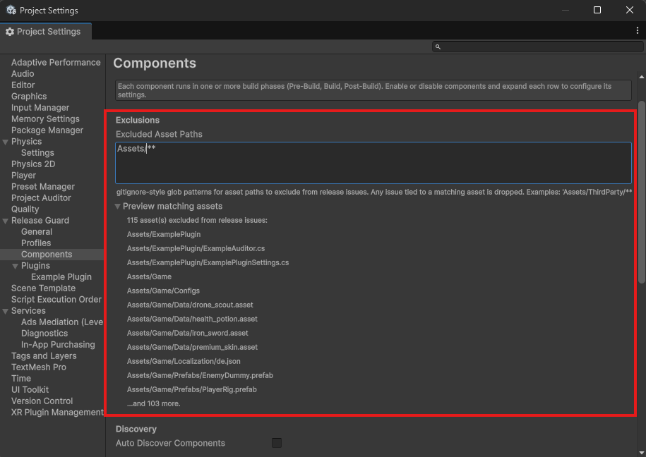

# Asset Exclusions

`components.excludedAssetPaths` lets you suppress findings tied to specific asset paths.

This only affects issues reported with an `assetPath`. Findings with no asset path, such as assembly-level `ReleaseForbidden` or some player-setting checks, cannot be filtered this way.

## Where exclusions apply

Exclusions are enforced centrally in `ReleaseGuardPreBuildContext.Report(...)`.

That means the behavior is uniform across:

- manual runs from the Pre-Build Checks window
- real builds
- built-in components
- custom components

There is no per-component exclusion system on top of this one.

That scope is narrower than "all Release Guard output". It applies to pre-build issue reporting only. It does not suppress:

- `build` event log entries
- `post-build` event log entries
- output-folder actions like `debug_symbol_sweep` warnings or deletions

## Pattern format

Patterns live in `components.excludedAssetPaths` and are matched by `AssetExclusionMatcher`.

The docs and tooltips describe them as gitignore-style globs. Typical uses:

```text
Assets/ThirdParty/**
Assets/Samples/**
*.generated.cs
!Assets/ThirdParty/MySecurityCriticalFile.cs
```



## When to use it

Good uses:

- third-party Android templates you cannot safely modify
- vendor `link.xml` files that intentionally preserve more than you would
- generated code or sample content included in the repository but not relevant to your shipping build

Bad uses:

- suppressing a real problem instead of fixing it
- using path exclusions to silence assembly-level or player-setting findings
- hiding entire directories without documenting why

## Important limitation

Asset exclusions do not stop components from running. They only drop matching reported issues after the component has already detected them.

If you want a component to stop running entirely for a profile, turn it off in the Components page for that profile. Under the hood, that writes `enabled = false` into that component's `componentToggles` entry.
