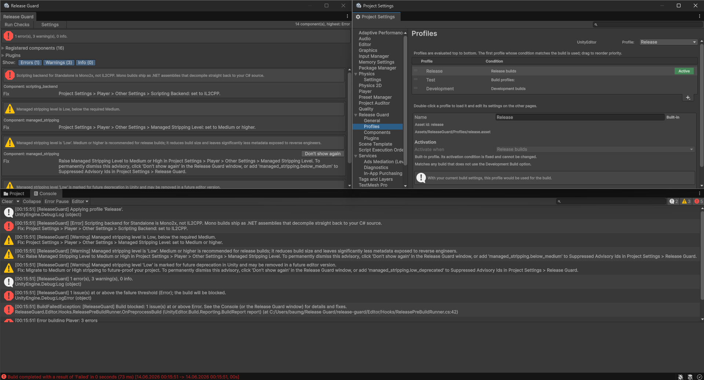
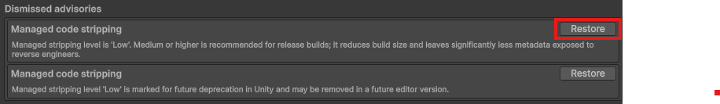

# Pre-Build Checks Window

The window lives at:

`Tools > Release Guard > Pre-Build Checks`

This guide uses the runtime's current terminology. The window dispatches the `pre-build` event only.

## What it actually does

When you click `Run Checks`, the window:

1. resolves the currently edited profile settings
2. creates a `ReleaseGuardPreBuildEvent` without a `BuildReport`
3. dispatches it through `ReleaseGuardPipeline`
4. shows the resulting `ReleaseGuardPreBuildReport`

That means:

- pre-build subscriptions run
- build subscriptions do not run
- post-build subscriptions do not run

The window is intentionally narrower than a real build.

## What the UI shows

- issue summary by severity
- registered components
- each component's subscribed phases
- registered plugins
- filters for `Error`, `Warning`, and `Info`
- issue details, fix hints, and asset ping buttons

## Advisory suppression

Dismissible advisories carry a `SuppressId`.

Clicking `Don't show again` writes that id into:

`AdvisorySuppressionStore`

Then Release Guard reloads and reruns the checks so the advisory disappears immediately.

This affects:

- future manual runs
- future real builds

because advisory suppression is evaluated in `ReleaseGuardPreBuildContext.Advisory(...)`.

You can review and restore dismissed advisories in:

`Edit > Project Settings > Release Guard > Advisories`

That page is project-scoped, not profile-scoped. Restoring an advisory there makes it eligible to appear again in both the checks window and real builds.

Each dismissed advisory can be restored individually.

## Common misunderstanding

The window is good for player-setting checks and assembly scans, but it does not prove your output folder is clean.

Anything subscribed to:

- `OnBuild(...)`
- `OnPostBuild(...)`

still requires a real build to run.
