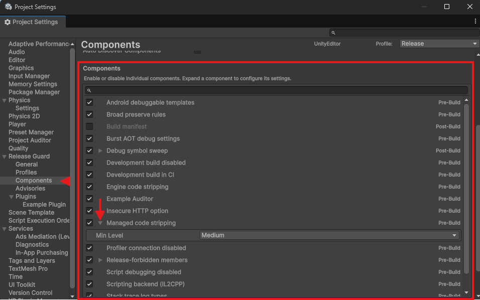

# Built-in Components Overview

Release Guard currently ships sixteen built-in components:

- fourteen `pre-build` components
- zero built-in `build` components
- two `post-build` components

## Why that split matters

`pre-build` components can block builds because they report `ReleaseIssue` instances that are compared against the active profile's failure threshold.

`build` and `post-build` components do not participate in build gating by default. They record logs and failures are handled as non-blocking component errors.

## Built-in component list

| Id | Display name | Event | Default posture |
|---|---|---|---|
| `scripting_backend` | Scripting backend (IL2CPP) | pre-build | blocking check |
| `managed_stripping` | Managed code stripping | pre-build | warning + advisories |
| `development_build` | Development build disabled | pre-build | blocking check |
| `ci_development_build` | Development build in CI | pre-build | blocking check |
| `script_debugging` | Script debugging disabled | pre-build | blocking check |
| `profiler_connection` | Profiler connection disabled | pre-build | blocking check |
| `broad_preserve` | Broad preserve rules | pre-build | blocking check |
| `release_forbidden` | Release-forbidden members | pre-build | severity comes from attribute |
| `android_debuggable` | Android debuggable templates | pre-build | blocking check |
| `webgl_exception_support` | WebGL exception support | pre-build | advisory |
| `strip_engine_code` | Engine code stripping | pre-build | advisory |
| `stack_trace_type` | Stack trace log types | pre-build | advisory |
| `insecure_http` | Insecure HTTP option | pre-build | advisory |
| `burst_debug` | Burst AOT debug settings | pre-build | advisory |
| `debug_symbol_sweep` | Debug symbol sweep | post-build | report or delete |
| `build_manifest` | Build manifest | post-build | opt-in artifact writer |

## Notes that are easy to miss

- `ci_development_build` exists independently of `development_build`.  
  Even if you intentionally relax the Development profile, CI can still block a development build job.

- `managed_stripping` is not purely blocking.  
  It can warn for being below the configured minimum, and it also emits separate advisories for "below Medium" and "Low is future-deprecated".

- `release_forbidden` severity is attribute-driven.  
  The component itself does not hardcode `Error` for every finding.

- There are no built-in `build`-phase components yet.  
  The phase exists for custom components and for the unified architecture, but the package does not currently ship any.

- `debug_symbol_sweep` and `build_manifest` are both output-folder oriented.  
  They are meant for pipeline hygiene and artifact handling, not player-facing functionality.

## Next step

Open the individual component page for the exact behavior before changing a setting:

Each component page now follows the same reference pattern:

- metadata block
- overview
- how it evaluates
- settings
- active-profile defaults
- common mistakes
- troubleshooting
- related docs

- [Scripting backend](components/scripting-backend.md)
- [Managed stripping](components/managed-stripping.md)
- [Debug symbol sweep](components/debug-symbol-sweep.md)
- [Build manifest](components/build-manifest.md)
